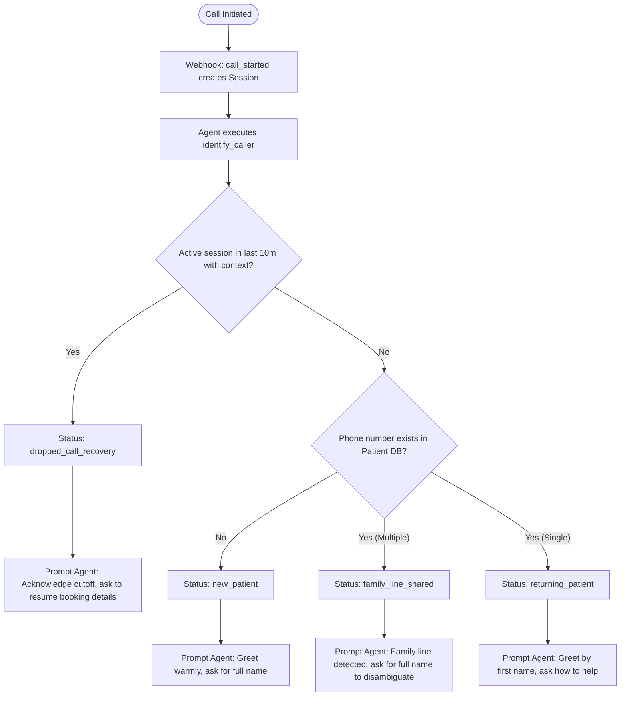

# Prompt & Prompt Logic: Voice AI Clinic Assistant

This document outlines the System Prompt and the underlying dialog logic used to drive the bilingual receptionist agent for Aarohan Clinics.

---

## 1. The System Prompt (`agent/system_prompt.txt`)
The exact system instructions configured in the Retell AI Dashboard can be found in your local project directory at [system_prompt.txt](file:///c:/Users/omen/OneDrive/Desktop/Voice%20AI%20Assignment/agent/system_prompt.txt).

---

## 2. Dialog & State Logic Analysis
Our voice agent utilizes a hybrid logic approach, combining the semantic reasoning of the LLM (`gpt-4o`) with stateful API hooks served by our FastAPI backend. 

Below is the logical workflow mapping out how the agent handles each requirement:

### A. Caller Identification Flow
At call initiation, the agent automatically executes the `identify_caller` tool:

### B. Booking & Name Capture Enforcement
To prevent anonymous bookings, the prompt enforces a strict security constraint:
1. **Pre-requisite:** Before booking, the agent *must* have captured the caller's first and last name.
2. **Even if recognized:** If a caller is identified as a returning patient (e.g., Rajesh Kumar), the agent's prompt logic instructs it: *"You must still explicitly verify/confirm their full name before executing `book_appointment`."*
3. **Write-Time Locks:** During `book_appointment`, the backend locks the practitioner row. If a slot conflicts at write-time, the tool returns `success: false` with the conflict description, prompting the agent to gracefully offer the next earliest slot.

### C. Bilingual Mid-Call Code-Switching (English / Hindi)
Instead of static translation tables, we leverage the native multilingual tokens of `gpt-4o` combined with structured prompt boundaries:
- **Mirroring:** The prompt instructs the agent to match the linguistic behavior of the caller. If the caller starts in English, speak English. If the caller switches to Hindi mid-sentence (Hinglish), the agent responds in natural Hinglish (e.g., *"Sure, main check karti hoon ki Dr. Ramesh kab available hain"*).
- **No Translation Latency:** Processing is done in a single LLM pass, avoiding middleware translation delays.

### D. Late Fee Announcement Logic (Rescheduling & Cancellation)
To prevent annoying patients with standard warning templates:
- **Conditional Trigger:** The system prompt instructs the agent **never** to mention fees upfront.
- **Backend Check:** When a caller requests a change, the agent executes `reschedule_appointment` or `cancel_appointment`. 
- **Response Handling:**
  - If `fee_applies` is `false`, the agent confirms the action immediately.
  - If `fee_applies` is `true`, the agent reads the `fee_amount` ($25) and says: *"Since this is within 24 hours of your appointment, there is a late fee of $25. Would you like to proceed?"*

### E. Redundancy Prevention (Contextual Memory)
The prompt enforces high conversational quality by instructing the LLM:
- *"Do not ask a question the caller has already answered."*
- When the user provides multiple slot details in a single phrase (e.g., *"Tomorrow afternoon with Dr. Ramesh"*), the agent maps these parameters directly to `search_earliest_slot(specialty='General Medicine', start_from='[Tomorrow]')` without querying the user for confirmation of the practitioner.
