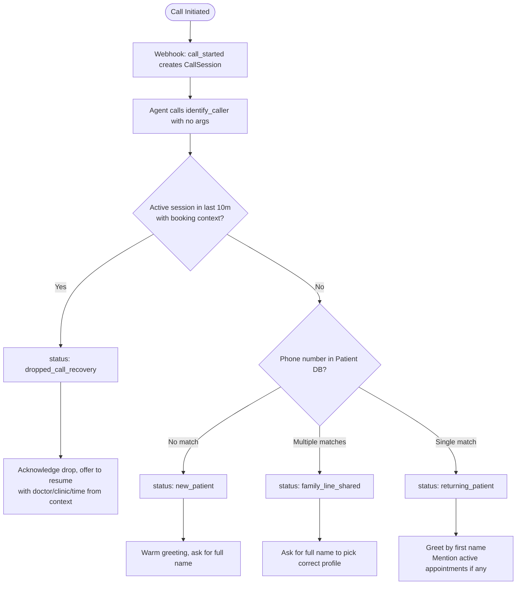

# Prompt & Prompt Logic: Voice AI Clinic Assistant

This document describes the system prompt design, tool contracts, and dialog logic driving the bilingual voice receptionist agent for Aarohan Clinics.

---

## 1. System Prompt (`agent/system_prompt.txt`)

The active system prompt is stored at `agent/system_prompt.txt`. The same content is embedded in `agent_import.json` under `"system_prompt"` for direct import into the Retell AI Dashboard. `SYSTEM_PROMPT.txt` (root) and `PROMPT_LOGIC.txt` are excluded from git (see `.gitignore`).

### Prompt Design Goals

| Goal | Implementation |
|---|---|
| Step-by-step conversation flow | **10-step state machine** defined in prompt — agent must complete each step before advancing |
| No phone number prompting | `identify_caller` is called with zero parameters; the backend injects the number from the Retell webhook |
| Prevent anonymous booking | Prompt enforces full name capture before every `book_appointment` execution |
| No unprompted fee warnings | Agent is told to mention fees **only** when `fee_applies: true` is returned from a tool |
| Bilingual support | GPT-4o native multilingual tokens; agent mirrors caller's language dynamically |
| One thing at a time | Strict rule: one question per turn, one slot per proposal |

---

## 2. Tool Reference & Response Contracts

All 7 tools are documented in the prompt so the LLM knows exactly what parameters to send and what fields to read.

### `identify_caller`
- **Trigger:** First action on every call — before any greeting
- **Input:** No parameters (phone number is injected automatically by the backend)
- **Response fields:**
  - `status`: `new_patient` | `returning_patient` | `family_line_shared` | `dropped_call_recovery`
  - `patient_name`: full name if matched
  - `appointments`: list of active appointments — each has `appointment_id`, `practitioner_name`, `clinic_name`, `start_time`, `status`
  - `message`: ready-to-use greeting text
- **Agent behaviour per status:**

  | `status` | Agent action |
  |---|---|
  | `new_patient` | Warm greeting → ask for full name |
  | `returning_patient` | Greet by first name → read `message` → mention active appointments if any |
  | `family_line_shared` | Ask for full name to disambiguate profiles |
  | `dropped_call_recovery` | Acknowledge disconnection → ask to resume booking from `message` context |

> **Key fix:** `identify_caller` returns active `appointments` directly (with `appointment_id`), so the agent already has what it needs to reschedule/cancel without an extra lookup.

### `get_practitioners`
- **Trigger:** Caller asks about available doctors/specialties, or agent needs a `practitioner_id`
- **Input:** `specialty` (optional), `clinic_id` (optional)
- **Response:** List of `{id, name, specialty, clinic_name, clinic_location}`
- `id` is passed to `check_availability` and `book_appointment`

### `check_availability`
- **Trigger:** Caller specifies a particular doctor + time
- **Input:** `practitioner_id` (int), `start_time` (ISO 8601)
- **Response:** `{is_available, practitioner_name, reason}`
- If `is_available: false` → agent apologises and calls `search_earliest_slot`

### `search_earliest_slot`
- **Trigger:** Caller wants "earliest" slot, or `check_availability` fails
- **Input:** `specialty` (optional), `clinic_id` (optional), `start_from` (optional ISO 8601)
- **Response:** `{success, slot: {practitioner_name, clinic_name, start_time, end_time, specialty}, message}`
- Agent presents **one slot only**. If caller declines, agent calls again with `start_from` set past the declined slot.

### `book_appointment`
- **Trigger:** Slot confirmed + full name collected
- **Input:** `first_name`, `last_name`, `practitioner_id`, `clinic_id`, `start_time` (ISO 8601)
- **Response:** `{success, appointment_id, patient_name, practitioner_name, clinic_name, start_time, message}`
- If `success: false` → agent apologises and calls `search_earliest_slot` for an alternative

### `reschedule_appointment`
- **Trigger:** Caller wants to move an existing appointment
- **Input:** `appointment_id` (from `identify_caller` response), `new_start_time` (ISO 8601)
- **Response:** `{success, new_start_time, fee_applies, fee_amount, message}`
- Fee handling: only mention fee if `fee_applies: true`; get caller consent before proceeding

### `cancel_appointment`
- **Trigger:** Caller wants to cancel
- **Input:** `appointment_id`
- **Response:** `{success, fee_applies, fee_amount, message}`
- Fee handling: warn caller and get consent *before* cancelling if `fee_applies: true`

---

## 3. Payload Structure Fix (`args` wrapping)

Retell AI wraps all custom tool arguments inside a nested `args` key in the HTTP POST body:

```json
{
  "call": {
    "call_id": "call_abc123",
    "from_number": "+15550199"
  },
  "args": {
    "practitioner_id": 1,
    "start_time": "2025-08-01T10:00:00"
  }
}
```

All FastAPI request models include an `Optional[Dict[str, Any]] args` field. Every endpoint handler reads top-level fields first, then falls back to `payload.args` if they are `None`. This makes the backend compatible with both Retell's live format and the local evaluation harness which posts flat JSON.

The `get_call_metadata()` helper extracts the phone number in this priority order:
1. `payload.call.from_number` (Retell live)
2. `payload.phone_number` (flat/harness)
3. `payload.args.phone_number` (nested harness variant)
4. Request headers (`x-retell-call-id`, `x-phone-number`)
5. DB session lookup by `call_id`

---

## 4. Caller Identification Flow



---

## 5. Conversation State Machine

The prompt enforces a strict 10-step flow. The agent must complete each step before advancing — it cannot combine or skip steps.

```
STEP 1  → Call identify_caller (before any greeting)
STEP 2  → Greet caller based on returned status
STEP 3  → Determine intent: book / reschedule / cancel / query
STEP 4  → Collect slot details ONE at a time
            (specialty → branch → date → time)
STEP 5  → Check availability (check_availability or search_earliest_slot)
STEP 6  → Present ONE slot. Get caller confirmation.
STEP 7  → Collect full name if not already confirmed this call
STEP 8  → Execute action (book / reschedule / cancel)
STEP 9  → Read confirmation back to caller
STEP 10 → Offer further help, then close gracefully
```

---

## 6. Booking & Name Capture Enforcement

- Agent **must** collect `first_name` + `last_name` verbally before calling `book_appointment`
- Even for `returning_patient` — the backend may have their name but the prompt still requires verbal confirmation for security
- If name was already given earlier in the same call, the agent reuses it — it does **not** ask again
- Backend `book_appointment` validates: if name fields are empty/blank, it returns HTTP 400 before any DB write

---

## 7. Bilingual / Hinglish Code-Switching

- The agent uses GPT-4o's native multilingual token space — no translation middleware
- Prompt instructs: *match the caller's language*. Caller speaks Hindi → respond in Hinglish
- Examples in prompt: `"Bilkul, main Dr. Ramesh ki availability check karti hoon."`, `"Aapka appointment kal subah 10 baje ke liye book ho gaya hai."`
- Code-switching happens within a single LLM pass — no extra latency

---

## 8. Late Fee Logic (Rescheduling & Cancellation)

- **Default behaviour:** The agent never mentions fees unless triggered
- **Backend trigger:** `reschedule_appointment` and `cancel_appointment` return `fee_applies: true` + `fee_amount` when the change is made within 24 hours of the appointment
- **Agent response when `fee_applies: true`:**
  - For reschedule: *"Just so you know, since this is within 24 hours, there is a rescheduling fee of [amount]. Would you like to go ahead?"*
  - For cancel: *"Cancelling now will incur a fee of [amount] as it's within 24 hours. Shall I proceed?"*
- Consent is always obtained **before** the action is finalised

---

## 9. Redundancy Prevention

- Prompt rule: *"Never repeat a question the caller has already answered"*
- If the caller provides multiple details in one sentence (e.g., *"Tomorrow afternoon with Dr. Ramesh"*), the agent maps all of them to the tool call directly — no intermediate confirmation of known parameters
- Call session context (stored per `call_id` in the `CallSession` DB table) persists queried practitioner/clinic/time across turns for dropped call recovery
